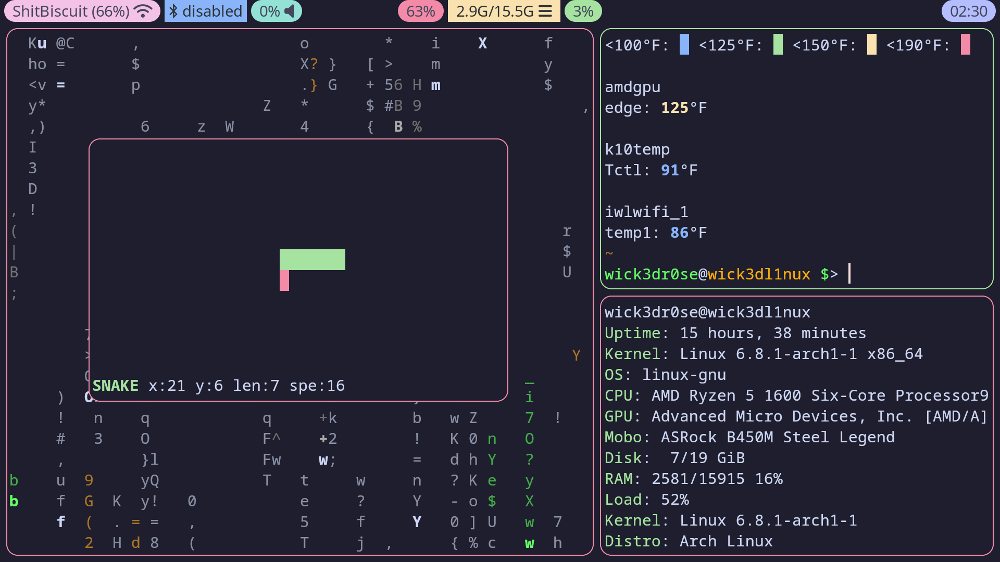
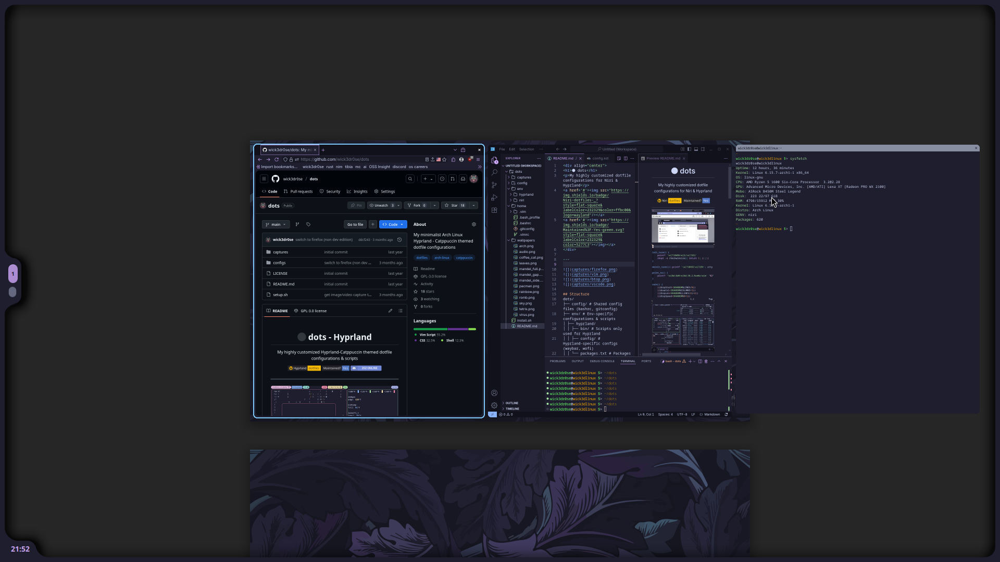

<h1>⚫ dots</h1>

My minimalist Arch Linux dotfile configs for Niri & Hyprland 

<a href='#'></img></a>

## Structure
dots/  
├── [config](config)/ - Common config files to symlink/copy into ~/.config/  
├── [env](env/)/ - Env-specific configurations & scripts  
│ ├── [hyprland](env/hyprland/)/  
│ │ ├── bin/ - Scripts only used for Hyprland  
│ │ ├── config)/ - Hyprland-specific configs (waybar, wofi)  
│ │ └── packages.txt) - Packages used with Hyprland  
│ └── [niri](env/niri/)/  
│ │ ├── bin/ - Scripts only used for Niri  
│ │ ├── config/ - Niri-specific configs (niri, quickshell)  
│ │ └── packages.txt - Packages used with Niri  
├── [home](home/)/ - Common files to symlink/copy into ~/  
└── install.sh - Main setup script (links/copies files, installs packages, ..)

## Environment Specific Configurations

<h3>Hyprland</h3>

<h3>Niri</h3>

> [!NOTE]
> I’ve switched to Niri (love it). Hyprland configs *may* not get as much love
